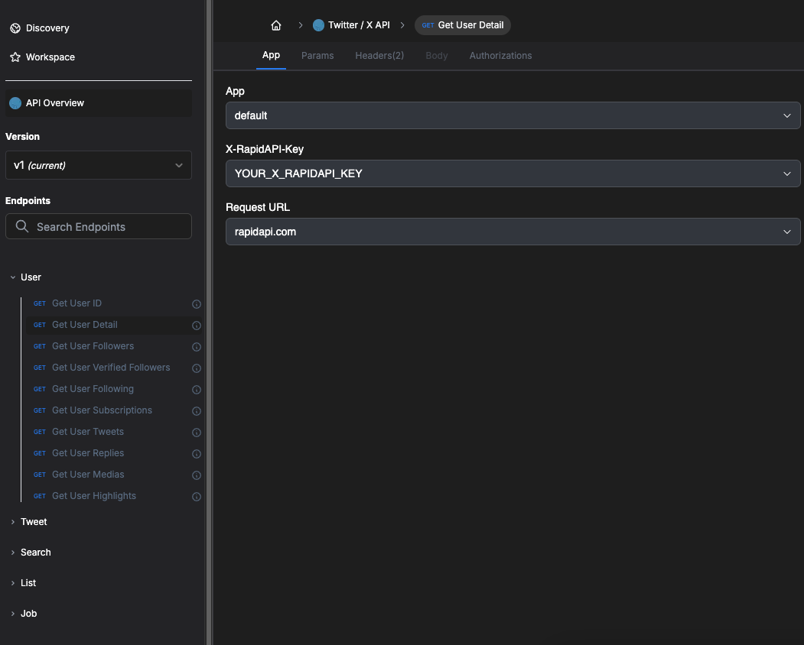

# Unofficial Twitter API In Python

<p align="center">
  
</p>

## Overview
This project is an unofficial Python wrapper for the Twitter API, enabling developers to easily access and retrieve data from Twitter without the need for Cookies or Proxies.

[](https://github.com/twittapi-labs/twitter-api/stargazers/)
[](https://github.com/twittapi-labs/twitter-api/network/)
[](https://github.com/twittapi-labs/twitter-api)
[](https://mit-license.org/)

## Sponsors
<div align="center">
  <a href="https://rapidapi.com/Lundehund/api/twitter-x-api" target="_blank">
    
    <div>
      <b>twittapi</b> is the fastest and most stable Twitter API available. Provides seamless integration and reliable performance for all your Twitter data needs. And don't need to use your cookie or worry about proxy.
    </div>
  </a>
</div>

## Installation
To install the package, use pip:
```bash
pip install twittapi
```

## Usage
Here's a basic example of how to use the API:

> First, you need to get the `X_RAPIDAPI_KEY`. See more: [How to get X_RAPIDAPI_KEY?](#how-to-get-x_rapidapi_key).

```python
from twittapi import TwitterAPI

X_RAPIDAPI_KEY = '<YOUR_X_RAPIDAPI_KEY>'
twitter = TwitterAPI(X_RAPIDAPI_KEY)

# Get user detail
user_detail = twitter.get_user_detail(username='taylorswift13')
print(user_detail)

# Get user tweets
user_id = user_detail['user']['result']['rest_id']
tweets = twitter.get_user_tweets(user_id=user_id)
print(tweets)
```

## How to get X_RAPIDAPI_KEY?
To get your X_RAPIDAPI_KEY, follow these steps:

1. Go to the RapidAPI website: [RapidAPI](https://rapidapi.com/)

2. Sign up for a free account or log in if you already have one.

3. Navigate to the Twitter API page: https://rapidapi.com/Lundehund/api/twitter-x-api

4. Subscribe to the API by selecting a pricing plan that suits your needs.

5. After subscribing, you will be able to find your API key in the "App" tab section of your RapidAPI dashboard.



6. Copy the API key and use it to initialize the TwitterApi class in your code.

## Examples

Go to the `/examples` folder to view more snippet code and example data.

## Contributing
Contributions are welcome! If you find this project helpful, please consider starring the repository on [GitHub](https://github.com/twittapi-labs/twitter-api) ⭐️

## Additional Resources
Here are some additional resources you might find helpful:

- [Unoffical Twitter API on RapidAPI](https://rapidapi.com/Lundehund/api/twitter-x-api)
- [Twitter Scraper](https://apify.com/twittapi?fpr=hs6s8)

## License
This project is licensed under the MIT License. See the [LICENSE](LICENSE) file for more details.
